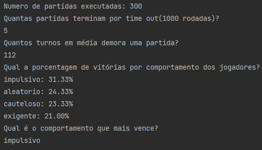

# Desafio Secreto

    Utilizando a linguagem de programação Python.
    Desenvolver um jogo semelhante ao Banco Imobiliário, obedecendo os requisitos propostos.
    O intuito desse desafio é analisar minha qualidade de código assim como o raciocinio lógico.

# Requisitos
    - Jogadores = 4
    - Propriedades = 20
    - N° maximo de rodadas = 1000
    - Beneficio por jogador dar uma volta no tabuleiro = 100
    - Cada propriedade tem um custo de venda, um valor de aluguel, um proprietário caso já estejam compradas
    - Saldo incial dos jogadores = 300
    - O jogador impulsivo compra qualquer propriedade sobre a qual ele parar.
    - O jogador exigente compra qualquer propriedade, desde que o valor do aluguel dela seja maior do que 50.
    - O jogador cauteloso compra qualquer propriedade desde que ele tenha uma reserva de 80 saldo sobrando depois de realizada a compra.
    - O jogador aleatório compra a propriedade que ele parar em cima com probabilidade de 50
    - O Jogador só pode comprar propriedades caso ela não tenha dono e o jogador tenha o dinheiro.
    - Ao comprar uma propriedade, o jogador perde o dinheiro e ganha a posse da propriedade.
    - Ao cair em uma propriedade que tem proprietário, o jogador deve pagar ao proprietário o valor do aluguel da propriedade.

# Perguntas que a aplicação deve responder após ser executada
    - Quantas partidas terminam por time out (1000 rodadas)?
    - Quantos turnos em média demora uma partida?
    - Qual a porcentagem de vitórias por comportamento dos jogadores?
    - Qual o comportamento que mais vence?

# Dependências
    Python 3.+
    Observação: A aplicação foi desenvolvida utilizando apenas as bibliotecas contidas no core do python,
    nenhuma biblioteca externa foi utilizada, por tanto, não foi criado um arquivo de depêndencias (requirement.txt)
    e não será necessário criar uma virtualenv.

# Executar
    Para executar a aplicação, clone esse diretório ou apenas baixe o diretório game e o arquivo principal:
        - game (Diretório contendo todo o código da aplicação, juntamente com os testes unitários)
        - main.py (Arquivo principal responsável por executar a aplicação e imprimir no console respostas para as perguntas)
    
Após baixar os arquivos execute o comando:

`python3 main.py`

# Resultado Esperado

