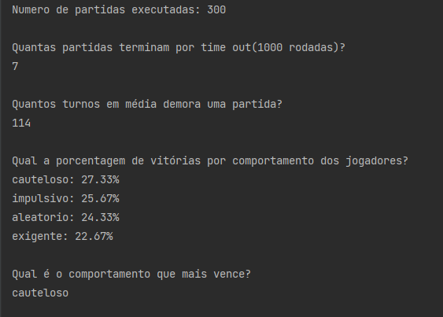
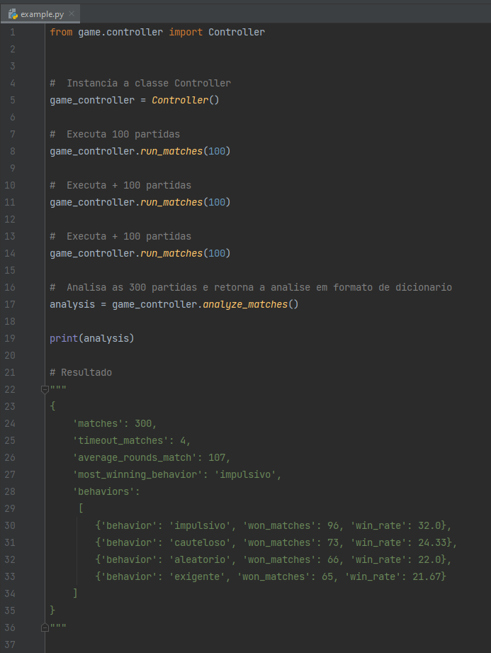

# Desafio Secreto

Utilizando a linguagem de programação Python,
desenvolver um jogo semelhante ao Banco Imobiliário, obedecendo os requisitos propostos.

# 1 - Requisitos
    - Jogadores = 4
    - Propriedades = 20
    - N° maximo de rodadas = 1000
    - Beneficio por jogador dar uma volta no tabuleiro = 100
    - Cada propriedade tem um custo de venda, um valor de aluguel, um proprietário caso já estejam compradas
    - Saldo incial dos jogadores = 300
    - O jogador impulsivo compra qualquer propriedade sobre a qual ele parar.
    - O jogador exigente compra qualquer propriedade, desde que o valor do aluguel dela seja maior do que 50.
    - O jogador cauteloso compra qualquer propriedade desde que ele tenha uma reserva de 80 saldo sobrando depois de realizada a compra.
    - O jogador aleatório compra a propriedade que ele parar em cima com probabilidade de 50
    - O Jogador só pode comprar propriedades caso ela não tenha dono e o jogador tenha o dinheiro.
    - Ao comprar uma propriedade, o jogador perde o dinheiro e ganha a posse da propriedade.
    - Ao cair em uma propriedade que tem proprietário, o jogador deve pagar ao proprietário o valor do aluguel da propriedade.

# 2 - Perguntas que a aplicação deve responder após ser executada
- Quantas partidas terminam por time out (1000 rodadas)?
- Quantos turnos em média demora uma partida?
- Qual a porcentagem de vitórias por comportamento dos jogadores?
- Qual o comportamento que mais vence?

# 3 - Dependências
- Python 3.6+

**Observação:** A aplicação foi desenvolvida utilizando somente as bibliotecas contidas no core do python,
nenhuma biblioteca externa foi utilizada, por tanto, não foi criado um arquivo de depêndencias (requirement.txt)
e não será necessário criar uma virtualenv.

# 4 - Executar
Para executar a aplicação, clone esse diretório ou apenas baixe o diretório game e o arquivo principal:
- **game** (Diretório contendo todo o código da aplicação e os testes unitários);
- **main.py** (Arquivo principal responsável por executar a aplicação e imprimir no console respostas para as perguntas).
    
Após baixar os arquivos, execute o comando:

`python3 main.py`

# 5- Resultado Esperado
Após executar, será impresso no seu console as respostas para as perguntas apresentadas no tópico 2.

Exemplo:

**Observação:** O resultado que irá aparecer para você, não será exatamente igual ao resultado apresentado na imagem. 

# 6 - Exemplo de uso
Caso queira utilizar esta app como uma feature do seu projeto:

- Baixe apenas o diretório **game**;
- Importe o modulo **Controller**;
    - `from game.controller import Controller`
- Instâncie a classe **Controller()**;
    - `gc = Controller()`
- Execute as partidas com a função **run_matches()**, passe como parâmetro o numero de partidas que o programa deve executar;
    - `gc.run_matches(300)`
- Obtenha o resultado da analise das partidas;
    - `analise = gc.analyze_matches()`
- Uso o resultado da forma que preferir.
  
Caso preferir no diretório **game/examples** possui um arquivo de exemplo (**example.py**).

